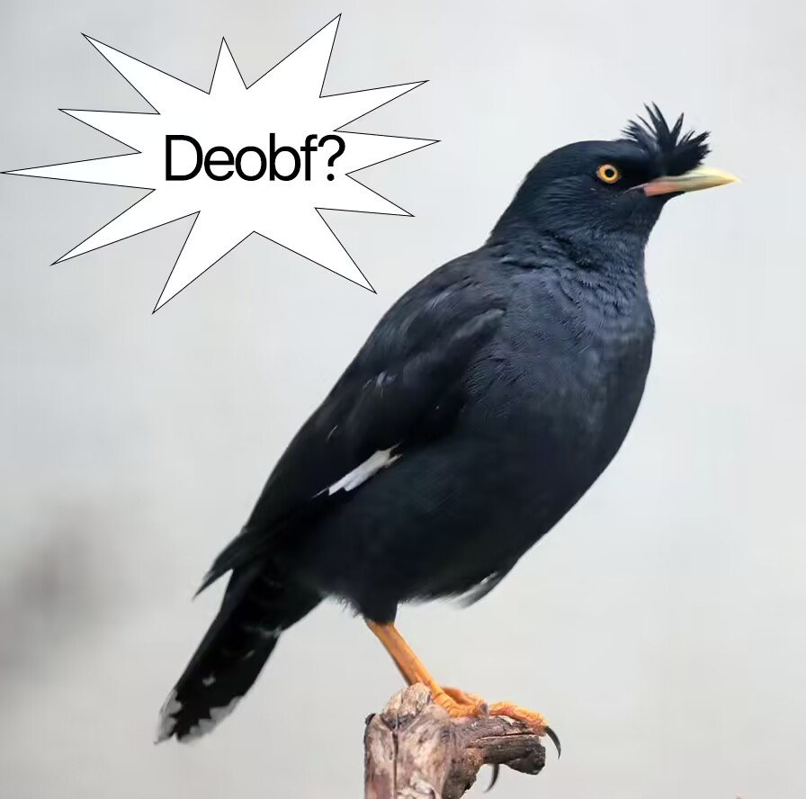
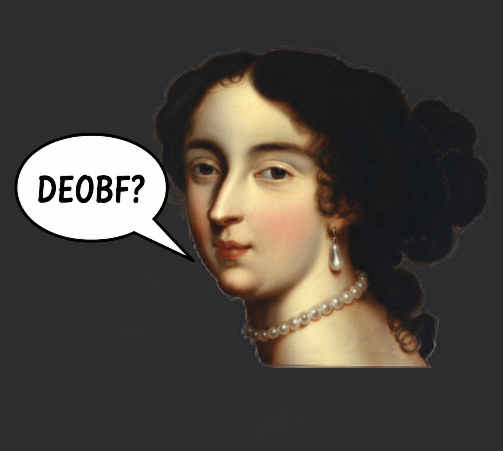

# Rise 6.9.5 but... OpenSource


<p align="center">
  
</p>
<p align="center">
  
  
  
  
</p>


## requirements

- JDK 21 or newer
- highiq

## modify

full offline, deobf, rename, fix, patch auth, add toggle and more...

## build

```
./gradlew clientJar
```

output: `build/dist/rise-client.jar`

## runnnnnnnnnn

```
./gradlew run
```

or directly (run `./gradlew gameDir` once first, see below):

```
java -Drise.gameDir=run -Djava.library.path=run/natives \
     -cp build/dist/rise-client.jar:libs/libraries.jar Start
```

## IntelliJ IDEA

1. open the project folder, wait for the gradle sync.
2. set the project SDK to JDK 21+.
3. select the **Rise Client** run configuration (committed in `.run/`) and hit run.

## system properties

all default to off.

| property | effect |
|---|---|
| `-Drise.auth.username=<name>` | username for the auth entry point |
| `-Drise.auth.autologin=true` | skip the login screen |
| `-Drise.gameDir=<path>` | game directory |
| `-Drise.protection.anticrack=true` | anti-crack environment scan |
| `-Drise.net.remotescripts=true` | remote script/config download |
| `-Drise.net.altservice=true` | alt-account service |
| `-Drise.net.versioncheck=true` | update gate on the login screen |
